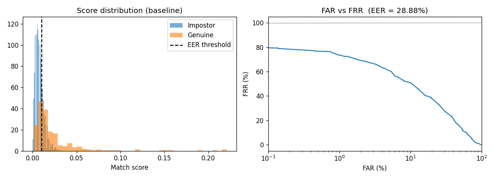
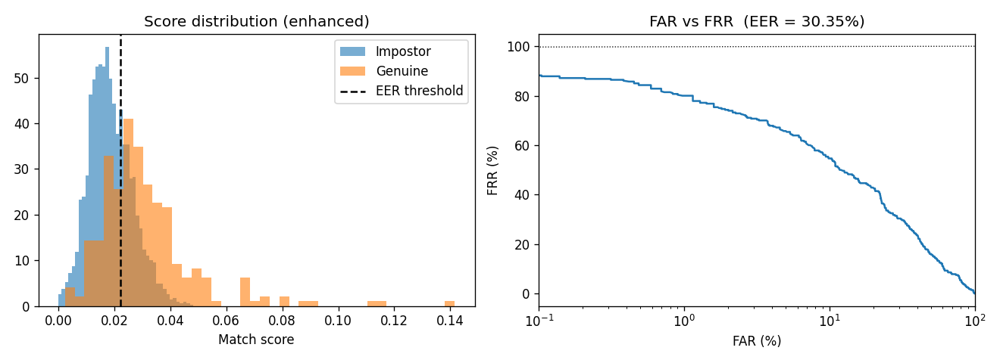

# Fingerprint Verification with Biometric Evaluation

Fingerprint verification pipeline on FVC2002 DB1_B with an ablation study
on Gabor enhancement, evaluated using standard biometric metrics.

## Pipeline
1. Preprocessing: histogram equalization (baseline) or oriented Gabor enhancement
2. Feature extraction: ORB keypoints and binary descriptors
3. Matching: Hamming distance with Lowe's ratio test, normalized score
4. Evaluation: all-pairs comparison (280 genuine, 2,880 impostor), FAR / FRR / EER

## Results
| Mode | EER (%) | Time (ms/image) |
|------|---------|-----------------|
| Baseline | 28.88% | Z1 |
| Gabor enhanced | 30.35% | Z2 |

## Usage
pip install fingerprint_enhancer opencv-python scikit-learn matplotlib
python fingerprint_eval.py --data DB1_B --no-enhance
python fingerprint_eval.py --data DB1_B

## Limitations
- Small dataset (80 images), so EER estimates have low confidence
- ORB is a general-purpose detector, not minutiae-based
- No liveness / spoof detection

## Future Work
- Minutiae-based matching
- Larger datasets (FVC2004, multiple sensors)
- C++ implementation for edge deployment

## Acknowledgements
Enhancement uses the open-source fingerprint_enhancer library by Utkarsh Deshmukh.
